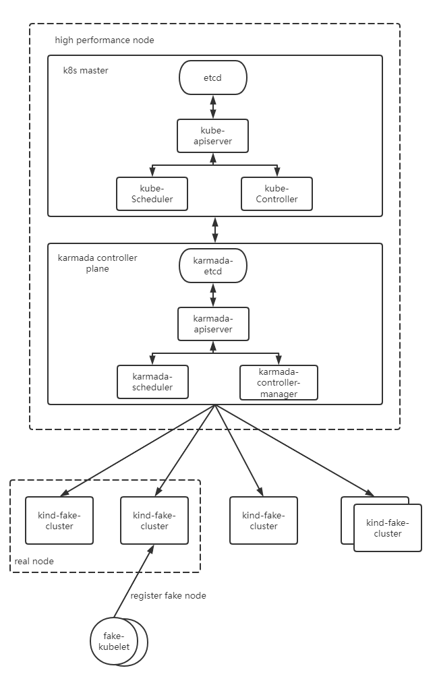
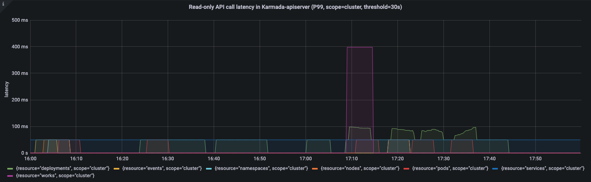
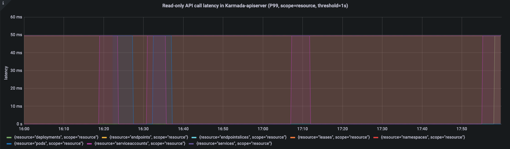
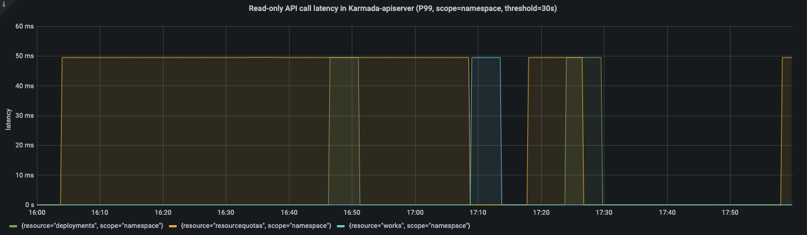
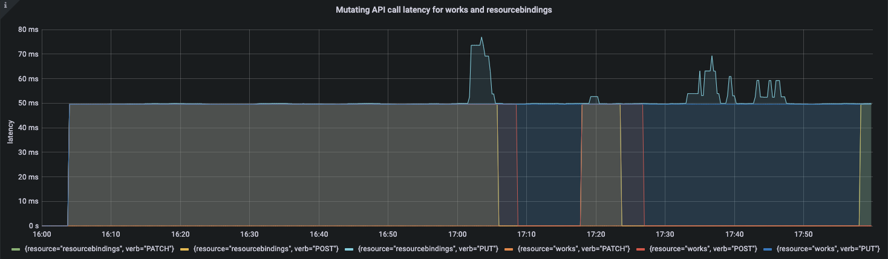
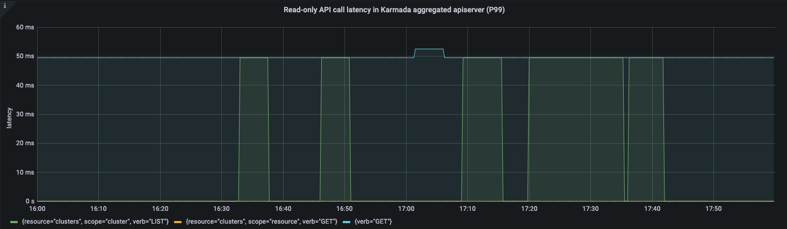
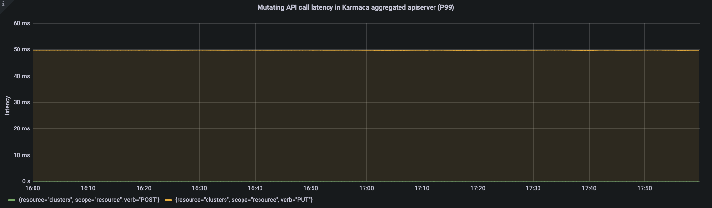

# Abstract

随着Karmada在越来越多的企业以及组织大规模落地，Karmada可扩展性和大规模逐步成为社区用户新的关注点。因此，我们开展了Karmada的大规模测试工作，现在我们宣布Karmada多云管理平台能够稳定支持100集群与500,000节点同时在线，并且管理超过2,000,000的pod。在本篇文章中，我们将介绍测试使用的相关指标，如何开展的大规模测试以及我们如何实现大规模节点和集群接入。

# Backgroud

随着云原生技术的不断发展以及使用场景的不断丰富，多云、分布式云逐渐成为引领云计算发展的潮流。著名分析公司Flexera在2021的调查报告显示，超过93%的企业正同时使用多个云厂商的服务，一方面受限于Kubernetes单集群的业务承载能力和故障恢复能力，单一的集群无法适应现有的企业业务，另一方面，在全球化的当下，企业出于避免被单家厂商垄断的目的，或是出于成本等因素考虑，更倾向于选择混合云或者多公有云的架构。
与此同时，Karmada社区的用户在落地的进程中也提出了多集群下大规模节点和应用管理的诉求。

# Introduction to Karmada

Karmada (Kubernetes Armada) is a Kubernetes management system that enables you to run your cloud-native applications across multiple Kubernetes clusters and clouds, with no changes to your applications. By speaking Kubernetes-native APIs and providing advanced scheduling capabilities, Karmada enables truly open, multi-cloud Kubernetes.

Karmada aims to provide turnkey automation for multi-cluster application management in multi-cloud and hybrid cloud scenarios, with key features such as centralized multi-cloud management, high availability, failure recovery, and traffic scheduling.

The Karmada Control Plane consists of the following components:

- Karmada API Server
- Karmada Controller Manager
- Karmada Scheduler

ETCD stores the Karmada API objects, the API Server is the REST endpoint all other components talk to, and the Karmada Controller Manager performs operations based on the API objects you create through the API server.

The Karmada Controller Manager runs the various controllers,  the controllers watch Karmada objects and then talk to the underlying clusters' API servers to create regular Kubernetes resources.

# Multi-cluster Scalability Dimensions and Thresholds

一个多集群系统的资源池规模不单指集群数量，即Scalability!=#Num of Clusters, 实际上多集群资源池规模包含很多维度的测量，在不考虑其他维度的情况下只考虑集群规模是毫无意义的。

我们将一个多集群的资源池规模按优先级描述为以下所示的三个维度：

1. Num of Clusters: 集群数量是衡量一个多集群系统资源池规模和承载能力最直接的维度，在其余维度不变的情况下系统能接入的集群数量越多，说明系统的资源池规模越大，承载能力越强。
2. Num of Resources: 对于一个多集群系统的控制面来说，存储并不是无限制的，而在控制面创建的资源对象的数量和总体大小受限于系统控制面的存储，也是制约多集群系统资源池规模的重要维度。这里的资源对象不仅指下发到成员集群的资源模板，而且还包括集群的调度策略、多集群服务等资源。
3. Cluster Size: 集群规模是衡量一个多集群系统资源池规模不可忽视的维度。一方面，集群数量相等的情况下，单个集群的规模越大，整个多集群系统的资源池越大。另一方面，多集群系统的上层能力依赖系统对集群的资源画像，例如在资源选择集群的调度过程中，集群资源是不可或缺的一个因素，同等情况下集群规模越大，对控制面的压力也就越大。
   在集群资源中，Node与Pod毫无疑问是其中最重要的两个资源，Node是计算、存储等资源的最小载体，而Pod数量则代表着一个集群的应用承载能力。
   * Num of Nodes
   * Num of Pods

对于多集群系统而言想要无限制地扩展各个维度而且又满足SLIs/SLOs各项指标显然是不可能实现的。并且多集群场景下各个维度会按集群数量继续进行拉伸，并且包括集群数量在内的各个维度不是完全独立的，某个维度被拉伸相应的其他维度就要被压缩。
以Clusters和Nodes两个维度举例，在100集群下将单集群的5k 节点拉伸到10k node的场景或者在单集群规格不变的同时扩展集群数量到200集群，其他维度的规格势必会受到影响。
如果各种场景都进行测试分析工作量是非常巨大的，在本次测试中，我们会重点选取典型场景配置进行测试分析。在满足SLIs/SLOs的基础上，实现单集群支持5k节点，20k pod规模管理的100规模的集群接入和管理。

# SLIs/SLOs

可扩展性和性能是多集群联邦的重要特性，作为多集群联邦的用户，我们期望在以上两方面有服务质量的保证。在进行大规模性能测试之前，我们需要定义测量指标。在参考了Kubernetes社区的SLI(Service Level Indicator)/SLO(Service Level Objectives)和多集群的典型应用，Karmada社区定义了以下SLI/SLO来衡量多集群联邦的服务质量。

1. API Call Latency


| Status  | SLI                                                                             | SLO                                                                              |
| --------- | --------------------------------------------------------------------------------- | ---------------------------------------------------------------------------------- |
| Offical | 最近5min对单个资源对象Mutating API调用（包括POST、PUT、DELETE、PATCH）的P99时延 | P99 <= 1s                                                                        |
| Offical | 最近5min的non-streaming的只读API调用（包括GET和LIST）的P99时延                  | Scope=resource, P99 <= 1s, Scope=namespace, P99 <= 5s, Scope=cluster, P99 <= 30s |

2. Cluster Register Latency


| Status  | SLI                                                                                         | SLO |
| --------- | --------------------------------------------------------------------------------------------- | ----- |
| Offical | 集群从接入联邦控制面到状态能被控制面正常收集的P99时延，不考虑控制面与成员集群之间的网络波动 | X   |

3. Resource Distribution Latency


| Status  | SLI                                                                                                             | SLO |
| --------- | ----------------------------------------------------------------------------------------------------------------- | ----- |
| Offical | 用户在联邦控制面提交资源模板和下发策略后到资源在成员集群上被创建的P99时延，不考虑控制面与成员集群之间的网络波动 | X   |

4. Resource usage


| Status | SLI                                                            | SLO  |
| -------- | ---------------------------------------------------------------- | ------ |
| WIP    | 在接入一定数量的集群后集群联邦维持其正常工作所必需的资源使用量 | 待定 |

# Test Tools

## ClusterLoader2

ClusterLoader2 is an open source Kubernetes cluster performance test tool. It can test the Kubernetes SLIs/SLOs to check whether the cluster meets the service quality standards. It also visualizes data for locating cluster problems and optimizing cluster performance.
After the test, users get a performance report with detailed test results. However, in the Karmada performance test process, since Clusterloader2 cannot obtain the resources of the member clusters to calculate the completion time of resource distribution, it can only test the indicators by calculating the completion time of distributed resources, which is not accurate.
Here we only use clusterloader2 to distribute resources.

## Prometheus

Prometheus is an open source system monitoring and alarm system, including data collection, data reporting, data monitoring and other functions. After analyzing the processing of various monitoring indicators by Clusterloader2, we use Prometheus to monitor various indicators of the control surface according to specific query statements.

## Kind

Kind is a tool for running local Kubernetes clusters using Docker container "nodes". In order to test Karmada's application distribution capabilities, we need a real single-cluster control plane to manage applications delivered by the federated control plane.
Kind is able to simulate a real cluster while saving resources.

## Fake-kubelet

Fake-kubelet is a tool for simulating any number of nodes and maintain pods on those nodes. Compared to Kubemark, fake-kubelet only does the minimum work of maintaining nodes and pods, and is very suitable for simulating a large number of nodes and pods for pressure testing on the control plane.

# Cluster Deployment Scheme for the Test



The Kubernetes control plane is deployed with one master node. The etcd, kube-apiserver, kube-scheduler, and kube-controller are deployed as single-instance.
The Karmada management plane components are deployed on the Kubernetes master node. The karmada-aggregated-apiserver, karmada-controller-manager, karmada-scheduler, and karmada-webhook are deployed in dual instances, and the rest are deployed as single-instance.
The components of both Kubernetes control plane and Karmada control plane run on high-performance nodes and do not limit resources.
We simulate a single master node cluster through kind and simulate work nodes in the cluster through fate-kubelet.

# Test Environment Information

Control Plane OS Version

`Ubuntu 18.04.6 LTS (Bionic Beaver)`

Kubernetes Version

`Kubernetes v1.23.10`

Karmada Version

`Karmada v1.3.0-4-g1f13ad97`

Karmada Control Plane Node Configurations

* CPU

```
Architecture:        x86_64
CPU op-mode(s):      32-bit, 64-bit
Byte Order:          Little Endian
CPU(s):              64
On-line CPU(s) list: 0-63
Thread(s) per core:  2
Core(s) per socket:  16
Socket(s):           2
NUMA node(s):        2
Vendor ID:           GenuineIntel
CPU family:          6
Model:               85
Model name:          Intel(R) Xeon(R) Gold 6266C CPU @ 3.00GHz
Stepping:            7
CPU MHz:             3000.000
BogoMIPS:            6000.00
Hypervisor vendor:   KVM
Virtualization type: full
L1d cache:           32K
L1i cache:           32K
L2 cache:            1024K
L3 cache:            30976K
NUMA node0 CPU(s):   0-31
NUMA node1 CPU(s):   32-63
```

* Memory

```
Maximum Capacity: 512 GB
```

* Disk

```
Disk /dev/vda: 200 GiB, 214748364800 bytes, 419430400 sectors
```

# Component Parameter Configurations

1. karmada-apiserver

```
--max-requests-inflight=2000
--max-mutating-requests-inflight=1000
```

2. karmada-aggregated-server

```
--kube-api-qps=200
--kube-api-burst=400
```

3. karmada-scheduler

```
--kube-api-qps=200
--kube-api-burst=400
```

4. karmada-controller-manager

```
--kube-api-qps=200
--kube-api-burst=400
```

5. karmada-agent

```
--kube-api-qps=40
--kube-api-burst=60
```

6. karmada-etcd

```
--quota-backend-bytes=8G
```

# Density Test

## Test Execution

The following table describes the detailed Kubernetes resource configurations:


| Maximum Type                 | Maximum Value |
| ------------------------------ | --------------- |
| Number of Clusters           | 100           |
| Number of Pods               | 2000000       |
| Number of Pods per Cluster   | 20000         |
| Number of Namespaces         | 20            |
| Number of Pods per Namespace | 1000          |

For details about test method and procedure, see the following links:

[https://github.com/kubernetes/perf-tests/blob/master/clusterloader2/docs/GETTING_STARTED.md](https://github.com/kubernetes/perf-tests/blob/master/clusterloader2/docs/GETTING_STARTED.md)

## Test Results

### Push Mode

APIResponsivenessPrometheusSimple:
(图片形式，karmada-apiserver和karmada-aggregated-apiserver，区分scope，readonly/mutate,threshold)

Cluster register latency:


| metric       | P50(ms) | P90(ms) | P99(ms) | SLO   |
| -------------- | --------- | --------- | --------- | ------- |
| cluster_join | xxxxxx  | xxxxx   | xxxxx   | xxxxx |

Resource Distribution Latency:


| metric                | P50(ms) | P90(ms) | P99(ms) | SLO   |
| ----------------------- | --------- | --------- | --------- | ------- |
| resource_distribution | xxxxxx  | xxxxx   | xxxxx   | xxxxx |

Etcd latency:
(图片形式，karmada-etcd)

资源使用情况：CPU、memory

### Pull Mode

APIResponsivenessPrometheus:













Cluster register latency:

Karmada's Pull deployment mode is suitable for private cloud Kubernetes scenarios. Such clusters usually do not have public IP addresses. Karmada-agent running on the member cluster side pulls the user-submitted application and runs it locally.
In Karmada 1.3, Karmada provides the ability to register Pull mode clusters based on Bootstrap tokens, which not only simplifies the cluster registration process, but also facilitates access control. In the process of pull mode cluster registration, a lot of time is spent on the installation of Karmada-agent in the member cluster. When the image is ready, it will depend on the latency of Pod startup within a single cluster.
In the actual test process, the delay of the whole process is about 5000ms.

Resource Distribution Latency:


| metric                | P50(ms) | P90(ms) | P99(ms) | SLO   |
| ----------------------- | --------- | --------- | --------- | ------- |
| resource_distribution | xxxxxx  | xxxxx   | xxxxx   | xxxxx |

Etcd latency:


Resource Usage:


## Conclusion and Analysis

给出karmada-apiserver在不同模式下的qps图片对比分析
